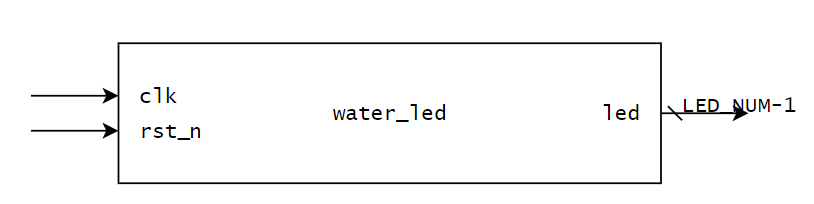
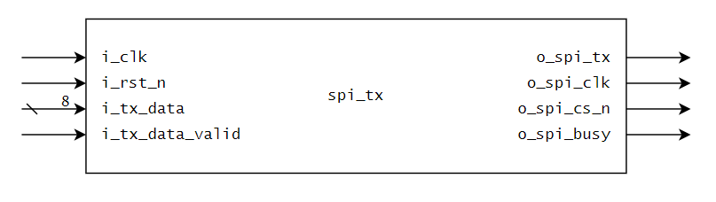

# FPGACode
## 000_water_led

流水灯程序



```verilog
parameter   LED_NUM      =  6           ,   // led quantity
parameter   COUNT_WIDTH  =  36          ,   // time counter bit quantity
parameter   COUNT_MAX    =  27_000_000  ,   // max count value
// LED MODE 1 ? 0 -> on       
parameter   LED_MODE     =  0   // led control mode: if 1 --> led on  or  0 --> led on      
```

```verilog
input                          clk          ,      // work clock       
input                          rst_n        ,      // reset
output      [LED_NUM-1:0]      led                 // led pin   
```

## 001_spi

### 1. Spi_Master Tx

spi 主设备发送



```verilog
parameter CPOL          =    1'b0        ,        // clock polarity
parameter CPHA          =    1'b0        ,        // clock phase -> simple time
parameter MAX_COUNT     =       3        ,        // counter max value -> spi work frequency
parameter COUNT_BITS    =       12                // how many bits can contain MAX_COUNT
```

```verilog
input           i_clk                   ,         // work clock
input           i_rst_n                 ,         // reset
input  [7:0]    i_tx_data               ,         // tx data
input           i_tx_data_valid         ,         // tx data valid
output          o_spi_tx                ,         // spi sda pin
output          o_spi_clk               ,         // spi sclk
output          o_spi_cs_n              ,         // spi ncs
output          o_spi_busy                        // the module is working 
```

